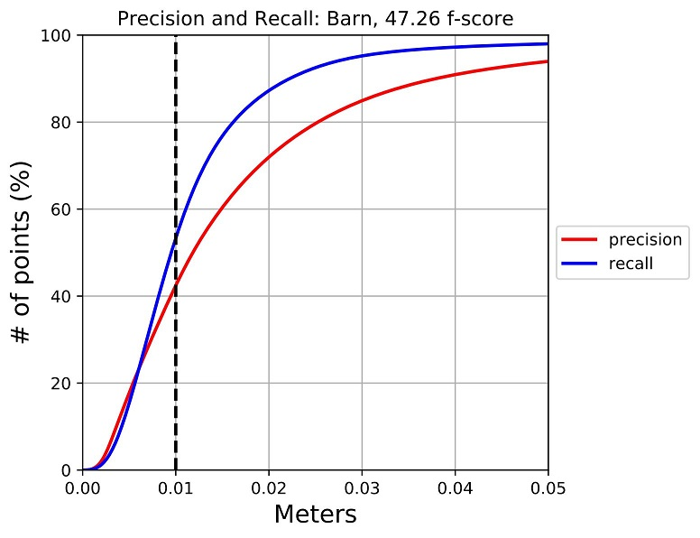
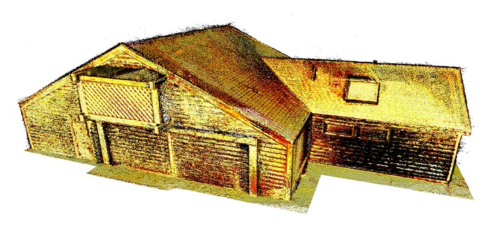
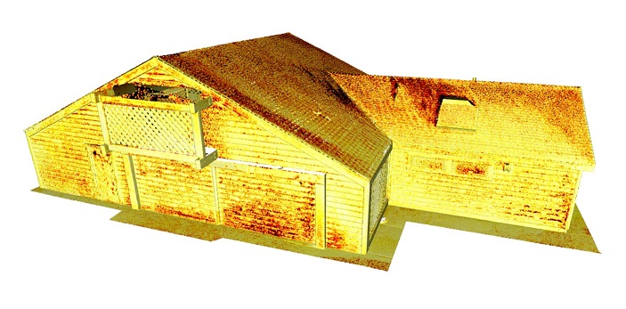

# Python Toolbox for Evaluation

This Python script evaluates **training** dataset of TanksAndTemples benchmark.
The script requires ``Open3D`` and a few Python packages such as ``matplotlib``, ``json``, ``numpy``.

## How to use:
**Step 0**. Reconstruct 3D model and recover camera poses from the training dataset.
The raw videos of the training dataset can be found from:
https://tanksandtemples.org/download/

**Step 1**. Download evaluation data (ground truth geometry + reference reconstruction) using
[this link](https://drive.google.com/open?id=1VDHEqGAuLyGa7Bv3lGOr1KX2RhPbHLxw). For this example, we regard ``TanksAndTemples/evaluation/data/`` as a dataset folder.

**Step 2**. Install Open3D. Follow instructions from http://open3d.org/docs/getting_started.html

**Step 3**. Clone this repository and follow instructions in ``setup.py``.

**Step 4**. Run the evaluation script and grab some coffee.
```
python run.py
```
This will show like below:
```
===========================
Evaluating Barn
===========================
TanksAndTemples/evaluation/data/Barn/Barn_COLMAP.ply
Reading PLY: [========================================] 100%
TanksAndTemples/evaluation/data/Barn/Barn.ply
Reading PLY: [========================================] 100%
:
Cropping geometry: [========================================] 100%
Pointcloud down sampled from 11165399 points to 6680529 points.
Pointcloud down sampled from 6680529 points to 4568550 points.
Cropping geometry: [========================================] 100%
Pointcloud down sampled from 12746387 points to 11729295 points.
Pointcloud down sampled from 11729295 points to 4397843 points.
ICP Iteration #0: Fitness 0.9980, RMSE 0.0333
ICP Iteration #1: Fitness 0.9980, RMSE 0.0332
ICP Iteration #2: Fitness 0.9979, RMSE 0.0332
[Registration] threshold: 0.150000
:
[EvaluateHisto]
Cropping geometry: [========================================] 100%
Pointcloud down sampled from 11165399 points to 6680305 points.
Pointcloud down sampled from 6680305 points to 6238213 points.
C:/git/TanksAndTemples/evaluation/data/Barn/evaluation//Barn.precision.ply
Cropping geometry: [========================================] 100%
Pointcloud down sampled from 12746387 points to 11729295 points.
Pointcloud down sampled from 11729295 points to 10532960 points.
[compute_point_cloud_to_point_cloud_distance]
[compute_point_cloud_to_point_cloud_distance]
:
[ViewDistances] Add color coding to visualize error
Reading PLY: [========================================] 100%
Writing PLY: [========================================] 100%
[ViewDistances] Add color coding to visualize error
Reading PLY: [========================================] 100%
Writing PLY: [========================================] 100%
[get_f1_score_histo2]
==============================
evaluation result : Barn
==============================
distance tau : 0.010
precision : 0.4244
recall : 0.5332
f-score : 0.4726
==============================
```
and so on for other datasets.

**Step 5**. Check the evaluation folders. For example, ``TanksAndTemples/evaluation/data/Barn/evaluation/`` will have following outputs.

``PR_Barn_@d_th_0_0100.pdf`` (F-score curve)


``Barn.precision.ply`` (Precision. Color coded by jet colormap)


``Barn.recall.ply`` (Recall. Color coded by jet colormap)

